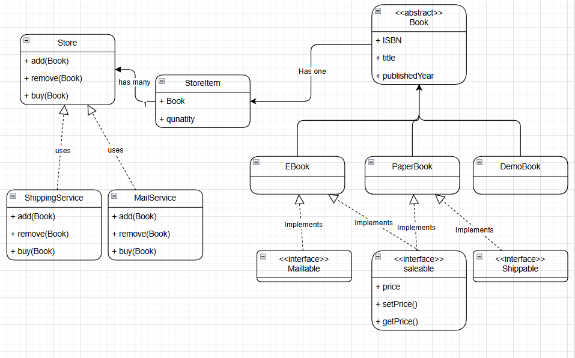

# FawryBookStoreQuestion

## How to Test

To test the project, simply open the `index.php` files

## Screens

### Shows the books after adding
This image shows the items of the bookstore after books have been added.

---

### Shows the books after Removing 
Removing all old books.

---

### The System UML

